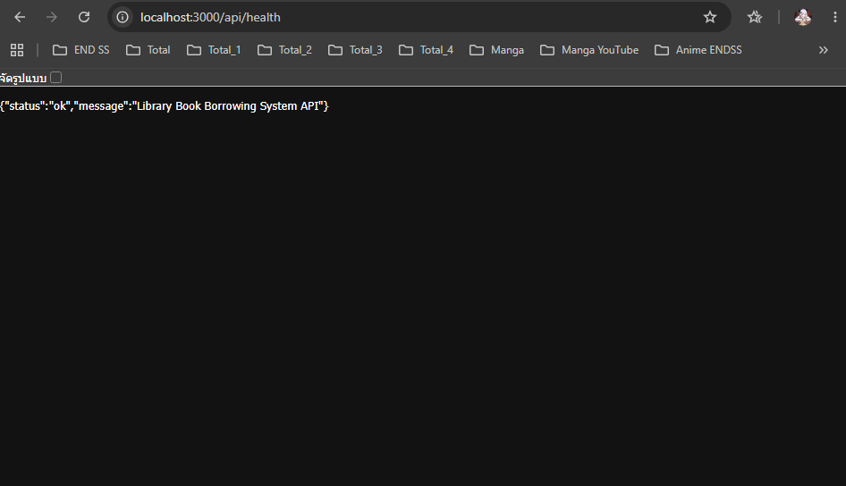
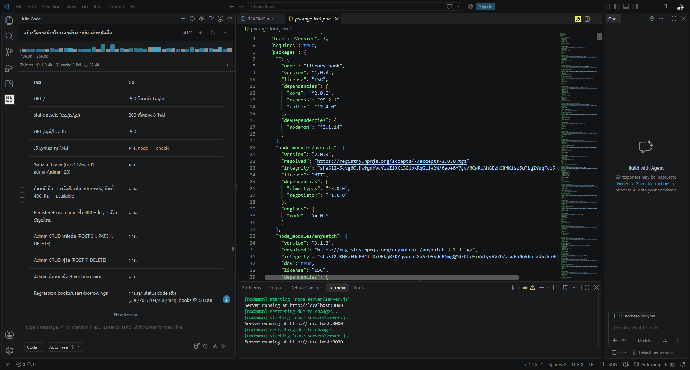

# Library Book Borrowing System

## สมาชิกกลุ่ม

| รหัสนักศึกษา | ชื่อ-นามสกุล | 
| 660910487 | นายชินกร เทพพงษ์ประดิษฐ  |
| 660910668 | นายบูรณ์ภัทร์ บุญสูขเกิด  | 
| 660911043 | นายสิงหา ฝอยทับทิม   | 

## หลักฐานการดีบัก

### Debug 1 - API Health


### Debug 2 - ผลการทดสอบระบบ


ระบบยืม-คืนหนังสือห้องสมุด (Mini Project)

## 1. รายละเอียดโปรเจกต์

โปรเจกต์นี้เป็นเว็บแอปพลิเคชันแบบ Full-stack สำหรับจัดการการยืมและคืนหนังสือของห้องสมุด พัฒนาด้วย Node.js + Express.js สำหรับ Backend และ HTML/CSS/JavaScript ล้วนสำหรับ Frontend ที่สื่อสารกับ Backend ผ่าน REST API โดยใช้ Fetch API

ระบบมีผู้ใช้งาน 2 ระดับสิทธิ์

- **User (ผู้ใช้งานทั่วไป)** เข้าสู่ระบบหรือสมัครสมาชิก ค้นหาและกรองหนังสือ ดูรายละเอียดและสถานะหนังสือ ยืมหนังสือ คืนหนังสือ และดูรายการที่กำลังยืมกับประวัติการยืม-คืนของตัวเอง
- **Admin (ผู้ดูแลระบบ)** ดูสถิติภาพรวม เพิ่ม/แก้ไข/ลบหนังสือ เพิ่ม/แก้ไข/ลบผู้ใช้งาน และตรวจสอบรายการยืม-คืนของผู้ใช้ทุกคน

## 2. Features

### User

- Login
- สมัครสมาชิก
- ค้นหาหนังสือ
- กรองหนังสือ
- ดูรายละเอียดหนังสือ
- ตรวจสอบสถานะหนังสือ
- ยืมหนังสือ
- คืนหนังสือ
- ดูรายการที่กำลังยืม
- ดูประวัติการยืม-คืน

### Admin

- Dashboard
- จัดการหนังสือ
- เพิ่ม/แก้ไข/ลบหนังสือ
- จัดการผู้ใช้งาน
- ตรวจสอบรายการยืม-คืน
- ตรวจสอบสถานะหนังสือ

## 3. Technologies

- Node.js
- Express.js
- HTML
- CSS
- JavaScript
- REST API
- Fetch API
- CORS
- Nodemon

หมายเหตุ: มีการติดตั้งแพ็กเกจ `multer` ไว้ใน `package.json` แต่ยังไม่ได้นำไปใช้งานในโค้ด เพราะระบบอัปโหลดรูปปกยังไม่ได้ทำในขั้นตอนนี้ (ปัจจุบันใช้รูป placeholder แทน)

## 4. Project Structure

```
Library Book/
├── server/
│   ├── data/
│   │   ├── books.js          # mock data หนังสือ 50 รายการ
│   │   ├── users.js          # mock data ผู้ใช้ 6 รายการ
│   │   └── borrowings.js     # mock data การยืม 5 รายการ
│   ├── routes/
│   │   ├── books.js
│   │   ├── users.js
│   │   └── borrowings.js
│   └── server.js
├── public/
│   ├── css/
│   │   └── style.css
│   ├── js/
│   │   ├── api.js            # ตัวห่อ Fetch API กลาง
│   │   ├── ui.js             # helper: badge, label, toast, modal
│   │   ├── auth.js           # หน้า Login / Register
│   │   ├── books.js          # รายการหนังสือ + รายละเอียด
│   │   ├── borrowings.js     # หนังสือที่กำลังยืม + ประวัติ
│   │   ├── admin.js          # Dashboard + CRUD หนังสือ/ผู้ใช้/การยืม
│   │   └── app.js            # hash router + session
│   ├── assets/
│   │   └── images/
│   │       └── book-placeholder.jpg
│   └── index.html
├── screenshots/
├── package.json
├── README.md
└── .gitignore
```

## 5. Installation

ต้องมี Node.js และ npm ติดตั้งไว้แล้ว แล้วรันคำสั่งในโฟลเดอร์โปรเจกต์

```bash
npm install
```

หากใช้เครื่อง Windows แล้ว PowerShell แจ้งข้อผิดพลาดว่า

```
npm.ps1 cannot be loaded because running scripts is disabled on this system
```

ให้ใช้คำสั่งแบบนี้แทน

```bash
npm.cmd install
```

## 6. Run the project

```bash
npm run dev
```

เครื่องที่ PowerShell บล็อก `npm.ps1`

```bash
npm.cmd run dev
```

รันแบบไม่ใช้ nodemon

```bash
npm start
```

เมื่อเซิร์ฟเวอร์ทำงานแล้ว เปิดเบราว์เซอร์ที่

```
http://localhost:3000
```

จะแสดงหน้า Login และตรวจสอบสถานะเซิร์ฟเวอร์ได้ที่ `http://localhost:3000/api/health`

## 7. REST API

รวม 17 endpoint (resource 15 + `/api/health` + `/`) ดังนี้

### Books — base URL `/api/books`

| Method | Endpoint | Description | Status code สำคัญ |
|---|---|---|---|
| GET | `/api/books` | ดึงหนังสือทั้งหมด (รองรับ query string filter) | 200 |
| GET | `/api/books/:id` | ดึงหนังสือตาม id | 200, 404 |
| POST | `/api/books` | เพิ่มหนังสือใหม่ | 201, 400 |
| PATCH | `/api/books/:id` | แก้ไขเฉพาะ field ที่ส่งมา | 200, 400, 404 |
| DELETE | `/api/books/:id` | ลบหนังสือ | 204, 404 |

### Users — base URL `/api/users`

| Method | Endpoint | Description | Status code สำคัญ |
|---|---|---|---|
| GET | `/api/users` | ดึงผู้ใช้ทั้งหมด | 200 |
| GET | `/api/users/:id` | ดึงผู้ใช้ตาม id | 200, 404 |
| POST | `/api/users` | เพิ่มผู้ใช้ใหม่ | 201, 400 |
| PATCH | `/api/users/:id` | แก้ไขเฉพาะ field ที่ส่งมา | 200, 400, 404 |
| DELETE | `/api/users/:id` | ลบผู้ใช้ | 204, 404 |

### Borrowings — base URL `/api/borrowings`

| Method | Endpoint | Description | Status code สำคัญ |
|---|---|---|---|
| GET | `/api/borrowings` | ดึงรายการยืมทั้งหมด (รองรับ query string filter) | 200 |
| GET | `/api/borrowings/:id` | ดึงรายการยืมตาม id | 200, 404 |
| POST | `/api/borrowings` | ยืมหนังสือ (ตรวจ user/book มีอยู่จริง และหนังสือต้องเป็น `available`) | 201, 400, 404 |
| PATCH | `/api/borrowings/:id` | แก้ไขรายการยืม (เปลี่ยนเป็น `returned` เพื่อคืนหนังสือ) | 200, 400, 404 |
| DELETE | `/api/borrowings/:id` | ลบรายการยืม | 204, 404 |

### อื่น ๆ

| Method | Endpoint | Description | Status code สำคัญ |
|---|---|---|---|
| GET | `/api/health` | ตรวจสอบสถานะเซิร์ฟเวอร์ | 200 |
| GET | `/` | หน้าเว็บแอป (`public/index.html`) | 200 |

## 8. Query String Filters

### Books

รองรับ 3 พารามิเตอร์ คือ `type`, `category` และ `status` (ใช้ร่วมกันได้)

```
GET /api/books?type=textbook
GET /api/books?type=comic

GET /api/books?category=science
GET /api/books?category=math
GET /api/books?category=thai
GET /api/books?category=fantasy
GET /api/books?category=romantic
GET /api/books?category=mystery

GET /api/books?status=available
GET /api/books?status=borrowed
```

### Borrowings

รองรับ 3 พารามิเตอร์ คือ `userId`, `bookId` และ `status`

```
GET /api/borrowings?userId=1
GET /api/borrowings?bookId=1
GET /api/borrowings?status=borrowed
GET /api/borrowings?status=returned
```

### Users

`GET /api/users` และ `GET /api/users/:id` ไม่รองรับ query string filter ในเวอร์ชันนี้

## 9. HTTP Status Codes

| Code | ความหมายในระบบนี้ |
|---|---|
| 200 | คำขอสำเร็จ (ดึงข้อมูล, แก้ไขข้อมูล) |
| 201 | สร้างข้อมูลใหม่สำเร็จ (POST books, POST users, POST borrowings) |
| 204 | ลบข้อมูลสำเร็จ ไม่มี response body (DELETE ทุก resource) |
| 400 | ข้อมูลไม่ครบหรือไม่ถูกต้อง เช่น field ที่จำเป็นไม่ครบ, username ซ้ำ, ค่า enum ไม่ถูกต้อง, หนังสือถูกยืมอยู่แล้ว |
| 404 | ไม่พบ resource ที่ระบุ เช่น book, user หรือ borrowing ที่ไม่มีอยู่จริง |

## 10. Test Accounts

บัญชี Mock ที่มีอยู่จริงใน `server/data/users.js`

| สิทธิ์ | username | password | role |
|---|---|---|---|
| ผู้ดูแลระบบ | `admin` | `admin123` | admin |
| ผู้ใช้ | `user01` | `user123` | user |
| ผู้ใช้ | `user02` | `user123` | user |
| ผู้ใช้ | `user03` | `user123` | user |
| ผู้ใช้ | `user04` | `user123` | user |
| ผู้ใช้ | `user05` | `user123` | user |

> ระบบ Login เป็น **Mock Login** สำหรับ Mini Project เท่านั้น หน้าเว็บดึงรายชื่อผู้ใช้ทั้งหมดจาก `GET /api/users` แล้วเปรียบเทียบ username และ password ฝั่ง client เท่านั้น ยังไม่มีระบบยืนยันตัวตนจริง

## 11. Test Results

ผลการทดสอบด้วย HTTP request จริงและ Fetch API จริงในระหว่างพัฒนา (รายละเอียดเพิ่มเติมดูหัวข้อ 14. Limitations)

### Books

| เคส | ผลที่ได้ |
|---|---|
| GET `/api/books` | 200 จำนวน 50 รายการ |
| GET filter ทั้ง 10 แบบ (type/category/status) | 200 ตรงกับจำนวนที่กำหนด เช่น textbook 30, comic 20, science 10, math 10, thai 10, fantasy 7, romantic 7, mystery 6 |
| GET `/api/books/1` | 200 |
| GET `/api/books/999` | 404 |
| POST ข้อมูลไม่ครบ | 400 |
| POST ค่า type ไม่ถูกต้อง | 400 |
| POST ข้อมูลครบถ้วน | 201 |
| PATCH ข้อมูลที่มีอยู่ | 200 และแก้เฉพาะ field ที่ส่งมา |
| PATCH id ไม่มี | 404 |
| DELETE ข้อมูลที่มีอยู่ | 204 ไม่มี response body |
| DELETE id ไม่มี | 404 |

### Users

| เคส | ผลที่ได้ |
|---|---|
| GET `/api/users` | 200 จำนวน 6 รายการ |
| GET `/api/users/1` | 200 |
| GET `/api/users/999` | 404 |
| POST ข้อมูลไม่ครบ | 400 |
| POST username ซ้ำ (`admin`) | 400 |
| POST role ไม่ถูกต้อง / email ไม่ถูกต้อง | 400 |
| POST ข้อมูลครบถ้วน | 201 |
| PATCH ข้อมูลที่มีอยู่ | 200 แก้เฉพาะ field ที่ส่งมา |
| PATCH username ชนกับผู้ใช้อื่น | 400 |
| PATCH id ไม่มี | 404 |
| DELETE ข้อมูลที่มีอยู่ | 204 ไม่มี response body |
| DELETE id ไม่มี | 404 |

### Borrowings

| เคส | ผลที่ได้ |
|---|---|
| GET `/api/borrowings` | 200 จำนวน 5 รายการ |
| GET filter `userId` / `bookId` / `status` | 200 (ตรวจแล้วว่ากรองถูกต้อง) |
| GET `/api/borrowings/1` | 200 |
| GET `/api/borrowings/999` | 404 |
| POST ข้อมูลไม่ครบ | 400 |
| POST userId ไม่มีจริง | 404 |
| POST bookId ไม่มีจริง | 404 |
| POST หนังสือถูกยืมอยู่แล้ว | 400 |
| POST ยืมสำเร็จ | 201 หนังสือเปลี่ยนเป็น `borrowed` และ borrowing เป็น `borrowed`, `returnDate` = null |
| PATCH เปลี่ยนเป็น `returned` | 200 ตั้ง `returnDate` เป็นวันที่คืน และหนังสือกลับเป็น `available` |
| PATCH id ไม่มี | 404 |
| PATCH status ไม่ถูกต้อง | 400 |
| DELETE ข้อมูลที่มีอยู่ | 204 ไม่มี response body |
| DELETE id ไม่มี | 404 |

### Frontend

| เคส | ผลที่ได้ |
|---|---|
| GET `/` | 200 คืนหน้า Login |
| ไฟล์ static (css, js ทุกไฟล์, รูป placeholder) | 200 |
| GET `/api/health` | 200 |
| Syntax ของไฟล์ JavaScript ทั้ง 7 ไฟล์ | ผ่าน `node --check` |

### Login / Register / ยืม-คืน (จำลองการทำงานของ Frontend ด้วย Fetch API)

| เคส | ผลที่ได้ |
|---|---|
| Login ด้วย `user01` / `user123` | พบผู้ใช้ role `user` |
| Login ด้วย `admin` / `admin123` | พบผู้ใช้ role `admin` |
| ยืมหนังสือ | 201 หนังสือเปลี่ยนเป็น `borrowed` |
| ยืมหนังสือเล่มเดิมซ้ำ | 400 |
| คืนหนังสือ | 200 หนังสือกลับเป็น `available` |
| ดูประวัติการยืม-คืน | 200 เห็นรายการที่เพิ่งคืน |
| Register ผู้ใช้ใหม่ | 201 และ login ด้วยบัญชีใหม่ได้ |
| Register username ซ้ำ | 400 |

### Admin

| เคส | ผลที่ได้ |
|---|---|
| เพิ่มหนังสือ (POST) | 201 |
| แก้ไขหนังสือ (PATCH) | 200 |
| ลบหนังสือ (DELETE) | 204 |
| เพิ่มผู้ใช้ (POST) | 201 |
| ลบผู้ใช้ (DELETE) | 204 |
| คืนหนังสือจากหน้า Admin | 200 และหนังสือกลับเป็น `available` |
| ลบรายการยืม (DELETE) | 204 |

### Regression test

หลังเพิ่ม Frontend แล้วทดสอบ API เดิมทั้ง 3 resource อีกครั้ง ผลตรงกับการทดสอบก่อนหน้าทุกเคส และ mock data ไม่ถูกลบออกจาก source code (books ยังคงมี 50 รายการ, users 6 รายการ, borrowings 5 รายการในไฟล์ข้อมูล) การเปลี่ยนแปลงจำนวนรายการที่เห็นระหว่างทดสอบเกิดจากการ POST/DELETE ผ่าน API ใน runtime เท่านั้น

## 12. Screenshots

### ภาพหลักฐานการ Debug/Test REST API

<!-- TODO: บันทึกภาพหลักฐานการทดสอบ REST API เช่น ผลลัพธ์จาก Postman/เบราว์เซอร์ DevTools แล้วบันทึกเป็น screenshots/api-test.png -->


### ภาพหลักฐานหน้าเว็บไซต์

<!-- TODO: บันทึกภาพหน้าเว็บไซต์ (หน้า Login และหน้า Dashboard/รายการหนังสือ) แล้วบันทึกเป็น screenshots/website.png -->


> ยังไม่มีไฟล์ภาพจริงในโฟลเดอร์ `screenshots/` ต้องบันทึกภาพแล้ววางไฟล์ตามชื่อด้านบนก่อนส่งงาน

## 13. Data Storage

ข้อมูลทั้งหมดในเวอร์ชันนี้เก็บแบบ **in-memory mock data** ในไฟล์ JavaScript ไม่ได้ใช้ Database

| ไฟล์ | ข้อมูล |
|---|---|
| `server/data/books.js` | หนังสือ 50 รายการ (textbook 30, comic 20) |
| `server/data/users.js` | ผู้ใช้ 6 รายการ (admin 1, user 5) |
| `server/data/borrowings.js` | รายการยืม 5 รายการ |

ข้อมูลจะ **รีเซ็ตกลับไปเป็นค่าเริ่มต้นทุกครั้งที่ restart เซิร์ฟเวอร์** การเพิ่ม แก้ไข หรือลบข้อมูลผ่าน API จะมีผลเฉพาะในรอบการรันเซิร์ฟเวอร์นั้นเท่านั้น ไม่ถูกบันทึกลงไฟล์

## 14. Limitations

ข้อจำกัดของโปรเจกต์ในเวอร์ชันนี้

- ยังไม่ได้ใช้ Database ข้อมูลทั้งหมดเป็น in-memory mock data และรีเซ็ตเมื่อ restart เซิร์ฟเวอร์
- Login เป็น Mock แบบ client-side เปรียบเทียบ username/password ที่ได้จาก `GET /api/users` เท่านั้น ไม่มีการยืนยันตัวตนจริง
- Password เก็บเป็น plain text และ `GET /api/users` คืนค่า password กลับไปด้วย ยังไม่ได้ทำ hashing
- ยังไม่มีระบบ JWT, session หรือ role-based access control ฝั่ง server
- Session ของผู้ใช้เก็บใน `localStorage` ของเบราว์เซอร์
- ยังไม่ได้ทำระบบอัปโหลดรูปปกจริง ใช้รูป placeholder (`public/assets/images/book-placeholder.jpg`) แทน
- ยังไม่มีระบบค้นหาขั้นสูง (เช่น ค้นหาตามผู้เขียน, ISBN, ปีพิมพ์) และไม่มี pagination
- ตรวจสอบ input บางส่วนทำที่ฝั่ง server และฝั่ง client เท่านั้น ยังไม่มี rate limiting และ security header
- ไม่มีการจัดการกรณีแย่งหนังสือ (race condition) และไม่มีระบบแจ้งเตือนก่อนครบกำหนด

## 15. Repository

<!-- TODO: ใส่ GitHub Repository URL ภายหลัง -->
Repository URL: _ยังไม่ได้กำหนด_

## 16. License

หมายเหตุ: `package.json` ระบุ `"license": "ISC"` ไว้ แต่โปรเจกต์นี้จัดทำขึ้นเพื่อการศึกษา (Mini Project) ไม่ได้มีเจตนาใช้งานเชิงพาณิชย์ และไม่ได้ออกแบบมาให้พร้อมใช้งานในระบบ Production
